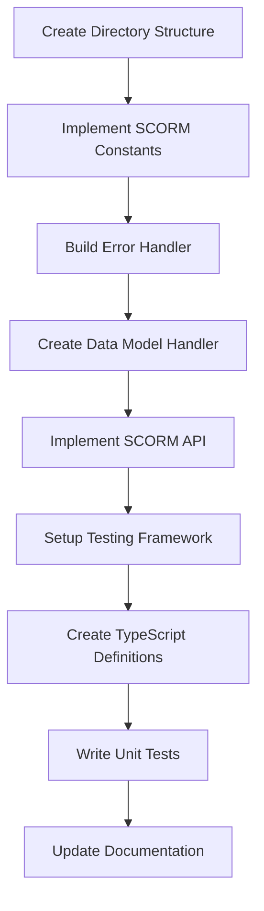

# SCORM Tester Refactoring Migration Plan

## Executive Summary

This document outlines the comprehensive refactoring plan to transform the SCORM Tester from a monolithic Electron application into a modern, modular, SCORM 2004 4th Edition compliant system with enhanced maintainability and AI tool compatibility.

## Current State Analysis

### Existing Architecture Issues
- **Monolithic Files**: `main.js` (1507 lines) and `app.js` (1570 lines) contain mixed concerns
- **Tight Coupling**: Components are heavily interdependent
- **Limited Modularity**: Difficult to extend or modify individual features
- **Inconsistent Patterns**: Different error handling and logging approaches
- **Documentation Gaps**: Missing API documentation and architectural overview

### Technical Debt Assessment
```
File Size Analysis:
├── main.js: 1507 lines (Target: <200 lines)
├── app.js: 1570 lines (Target: <200 lines)  
├── index.html: 1120 lines (Target: <300 lines)
├── preload.js: 375 lines (Acceptable)
└── utils/*.js: Various sizes (Some need splitting)

Complexity Metrics:
├── Cyclomatic Complexity: High in main process handlers
├── Coupling: Tight coupling between UI and business logic
├── Cohesion: Low cohesion within large files
└── Testability: Limited due to monolithic structure
```

## Target Architecture

### Design Goals
1. **SCORM 2004 4th Edition Full Compliance**
2. **Modular Architecture** with clear separation of concerns
3. **File Size Limits** (max 200 lines per file)
4. **AI Tool Compatibility** with comprehensive documentation
5. **Enhanced Maintainability** and extensibility
6. **Comprehensive Testing** with SCORM compliance validation

### New Directory Structure
```
src/
├── main/                           # Main Electron process
│   ├── services/
│   │   ├── scorm/
│   │   │   ├── cam/               # Content Aggregation Model
│   │   │   │   ├── manifest-parser.js
│   │   │   │   ├── content-validator.js
│   │   │   │   └── metadata-handler.js
│   │   │   ├── rte/               # Run-Time Environment
│   │   │   │   ├── api-handler.js
│   │   │   │   ├── data-model.js
│   │   │   │   ├── session-manager.js
│   │   │   │   └── error-handler.js
│   │   │   └── sn/                # Sequencing and Navigation
│   │   │       ├── activity-tree.js
│   │   │       ├── sequencing-engine.js
│   │   │       ├── navigation-handler.js
│   │   │       └── rollup-manager.js
│   │   ├── file-manager.js
│   │   ├── window-manager.js
│   │   └── ipc-handler.js
│   └── main.js                    # Simplified main entry point
├── renderer/                      # Renderer process
│   ├── components/
│   │   ├── scorm/
│   │   │   ├── content-viewer.js
│   │   │   ├── navigation-controls.js
│   │   │   ├── progress-tracker.js
│   │   │   └── debug-panel.js
│   │   ├── ui/
│   │   │   ├── file-browser.js
│   │   │   ├── course-tree.js
│   │   │   └── status-bar.js
│   │   └── layout/
│   │       ├── main-layout.js
│   │       └── sidebar.js
│   ├── services/
│   │   ├── scorm-client.js        # SCORM API client
│   │   └── ui-state.js
│   └── app.js                     # Simplified renderer entry
├── shared/
│   ├── constants/
│   │   ├── scorm-constants.js     # SCORM-specific constants
│   │   ├── error-codes.js         # SCORM error codes
│   │   └── data-model-schema.js   # SCORM data model definitions
│   ├── types/
│   │   ├── scorm-types.d.ts       # TypeScript definitions
│   │   └── app-types.d.ts
│   └── utils/
│       ├── scorm-utils.js
│       ├── validation.js
│       └── logger.js
└── styles/                        # Extracted CSS
    ├── components/
    ├── layouts/
    └── themes/
```

## Migration Strategy

### Approach: Gradual Refactoring with Parallel Development

#### Phase-Based Implementation
1. **Foundation Phase**: Core SCORM infrastructure
2. **Content Processing Phase**: Manifest parsing and validation
3. **Sequencing Phase**: Navigation and sequencing engine
4. **Main Process Phase**: Service extraction and modularization
5. **Renderer Phase**: UI component refactoring
6. **Polish Phase**: Styling, documentation, and final testing

#### Risk Mitigation
- **Feature Flags**: Toggle between old and new implementations
- **Backward Compatibility**: Maintain existing functionality during transition
- **Incremental Testing**: Validate each phase before proceeding
- **Rollback Strategy**: Ability to revert to previous working state

## Implementation Phases

### Phase 1: Foundation (Weeks 1-2)
**Objective**: Establish core SCORM infrastructure and testing framework

#### Deliverables
- [ ] Complete directory structure creation
- [ ] SCORM constants and error code definitions
- [ ] Core data model implementation with all cmi.* elements
- [ ] SCORM API handler with all 8 required functions
- [ ] Comprehensive error handling system
- [ ] Unit testing framework setup
- [ ] TypeScript definitions for AI tool support

#### Success Criteria
- All SCORM API functions implemented and tested
- Error handling matches SCORM 2004 4th Edition specification
- Data model supports all required elements with proper validation
- 100% test coverage for core modules
- Documentation updated with new architecture

#### Implementation Steps


### Phase 2: Content Processing (Weeks 3-4)
**Objective**: Implement manifest parsing and content validation

#### Deliverables
- [ ] XML manifest parser with schema validation
- [ ] Content package validator with SCORM compliance checking
- [ ] Metadata extraction and handling system
- [ ] File integrity verification
- [ ] CAM compliance test suite
- [ ] Package type detection (Content Aggregation vs Resource)

#### Success Criteria
- Parses all valid SCORM 2004 4th Edition manifests
- Validates against both SCORM application profiles
- Comprehensive error reporting for invalid packages
- Integration with existing file management system
- Performance benchmarks meet or exceed current implementation

### Phase 3: Sequencing Engine (Weeks 5-6)
**Objective**: Build sequencing and navigation system

#### Deliverables
- [ ] Activity tree construction and management
- [ ] Sequencing rule evaluation engine
- [ ] Navigation request processing system
- [ ] Rollup behavior implementation
- [ ] SN compliance validation suite
- [ ] Integration with existing navigation UI

#### Success Criteria
- Correctly processes all SCORM sequencing rule types
- Handles complex navigation scenarios and edge cases
- Proper rollup of completion and success status
- Passes ADL sequencing test cases where applicable
- Maintains backward compatibility with existing courses

### Phase 4: Main Process Refactoring (Weeks 7-8)
**Objective**: Refactor main.js into modular services

#### Deliverables
- [ ] Window management service extraction
- [ ] IPC communication layer refactoring
- [ ] File system operations abstraction
- [ ] SCORM service integration layer
- [ ] Simplified main.js entry point (<200 lines)
- [ ] Service dependency injection system

#### Success Criteria
- Main.js reduced to under 200 lines
- Clear separation of concerns between services
- All existing functionality preserved
- Improved error handling and logging
- Enhanced debugging capabilities

### Phase 5: Renderer Refactoring (Weeks 9-10)
**Objective**: Break down app.js into modular components

#### Deliverables
- [ ] SCORM content viewer component
- [ ] Navigation controls system
- [ ] Progress tracking interface
- [ ] Debug panel with SCORM API monitoring
- [ ] UI state management system
- [ ] Component integration framework

#### Success Criteria
- App.js reduced to under 200 lines
- Reusable UI components with clear interfaces
- Proper SCORM API integration maintained
- Enhanced user experience and debugging tools
- Responsive design improvements

### Phase 6: Polish and Documentation (Weeks 11-12)
**Objective**: Extract CSS, improve styling, and finalize documentation

#### Deliverables
- [ ] Modular CSS architecture with component-based styling
- [ ] Theme system for customization
- [ ] Responsive design improvements
- [ ] Accessibility enhancements (WCAG compliance)
- [ ] Comprehensive API documentation
- [ ] Developer guides and tutorials
- [ ] Final compliance testing and validation

#### Success Criteria
- HTML reduced to under 300 lines
- Maintainable CSS structure with clear organization
- Consistent visual design across all components
- Improved accessibility scores
- Complete documentation for AI tool compatibility

## Quality Assurance Strategy

### Testing Approach
```
Testing Pyramid:
├── Unit Tests (70%)
│   ├── SCORM API functions
│   ├── Data model validation
│   ├── Error handling
│   └── Utility functions
├── Integration Tests (20%)
│   ├── Service interactions
│   ├── IPC communication
│   ├── File operations
│   └── SCORM workflow
└── End-to-End Tests (10%)
    ├── Complete SCORM package testing
    ├── User workflow validation
    └── Performance benchmarking
```

### Code Quality Standards
- **File Size**: Maximum 200 lines per file
- **Function Complexity**: Maximum cyclomatic complexity of 10
- **Test Coverage**: Minimum 90% code coverage
- **Documentation**: JSDoc comments for all public APIs
- **TypeScript**: Full type coverage for AI tool support
- **Linting**: ESLint with strict configuration
- **Performance**: No degradation in load times or memory usage

### SCORM Compliance Validation
- **Automated Testing**: Against SCORM 2004 4th Edition requirements
- **ADL Test Suite**: Integration where possible
- **Manual Testing**: With various SCORM packages
- **Regression Testing**: Ensure no compliance regressions
- **Performance Testing**: With large and complex SCORM packages

## Risk Management

### Technical Risks
| Risk | Impact | Probability | Mitigation Strategy |
|------|--------|-------------|-------------------|
| SCORM Compliance Issues | High | Medium | Extensive testing against SCORM test suites |
| Performance Degradation | Medium | Low | Performance benchmarking at each phase |
| Breaking Changes | High | Medium | Feature flags and gradual rollout |
| Integration Complexity | Medium | Medium | Incremental integration with thorough testing |

### Project Risks
| Risk | Impact | Probability | Mitigation Strategy |
|------|--------|-------------|-------------------|
| Scope Creep | Medium | High | Strict adherence to defined phases |
| Timeline Overrun | Medium | Medium | Buffer time built into each phase |
| Resource Constraints | High | Low | Prioritized feature implementation |
| Knowledge Transfer | Medium | Low | Comprehensive documentation |

## Success Metrics

### Technical Metrics
- **Maintainability**: Average file size < 200 lines
- **Modularity**: Clear separation of concerns achieved
- **Performance**: No degradation in application performance
- **Compliance**: 100% SCORM 2004 4th Edition compliance maintained
- **Test Coverage**: >90% code coverage across all modules
- **Documentation**: Complete API and architectural documentation

### Development Metrics
- **AI Tool Compatibility**: Improved code analysis and suggestions
- **Developer Experience**: Faster onboarding and debugging
- **Code Reusability**: Modular components for future features
- **Bug Reduction**: Decreased defect rate due to better structure
- **Feature Velocity**: Faster implementation of new features

## Timeline and Milestones

### 12-Week Implementation Schedule
```
Weeks 1-2:  Phase 1 - Foundation
Weeks 3-4:  Phase 2 - Content Processing  
Weeks 5-6:  Phase 3 - Sequencing Engine
Weeks 7-8:  Phase 4 - Main Process Refactoring
Weeks 9-10: Phase 5 - Renderer Refactoring
Weeks 11-12: Phase 6 - Polish and Documentation
```

### Key Milestones
- **Week 2**: Core SCORM infrastructure complete
- **Week 4**: Content processing system operational
- **Week 6**: Sequencing engine fully functional
- **Week 8**: Main process refactoring complete
- **Week 10**: UI components modularized
- **Week 12**: Final testing and documentation complete

## Post-Migration Benefits

### For Developers
- **Easier Maintenance**: Smaller, focused files
- **Better Testing**: Modular architecture enables better test coverage
- **Enhanced Debugging**: Clear separation of concerns
- **Faster Development**: Reusable components and services

### For AI Tools
- **Better Code Analysis**: Smaller files with clear responsibilities
- **Improved Suggestions**: Well-documented APIs and patterns
- **Enhanced Understanding**: Comprehensive architectural documentation
- **Easier Refactoring**: Modular structure supports automated refactoring

### For Users
- **Improved Performance**: Optimized architecture
- **Better Reliability**: Comprehensive testing and error handling
- **Enhanced Features**: Easier to add new functionality
- **Better Support**: Improved debugging and diagnostic tools

This migration plan provides a clear roadmap for transforming the SCORM Tester into a modern, maintainable, and fully compliant application while minimizing risks and ensuring continuous functionality throughout the process.