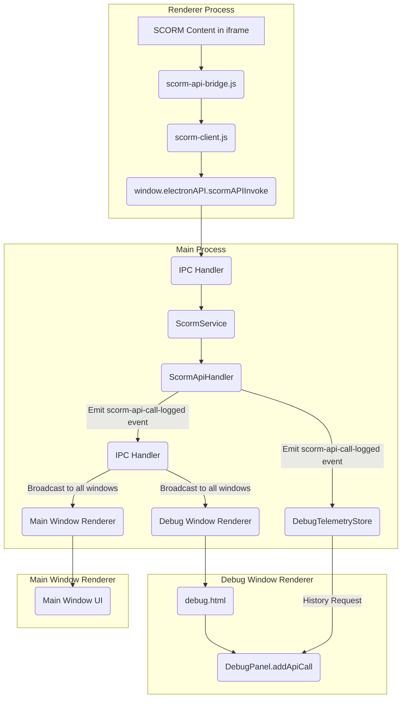

# SCORM Debug Panel Refactoring Plan

## 1. Introduction

This document outlines a refactoring plan for the SCORM Debug Panel to address issues with API traffic not appearing, improve data flow efficiency, and enhance clarity and consistency within the codebase. The plan incorporates feedback regarding the panel's non-legacy status, the need for historical data, and concerns about redundancy and naming.

## 2. Problem Statement

The current implementation of the SCORM Debug Panel suffers from several issues:
*   **API Traffic Not Displayed:** SCORM API calls are not reliably appearing in the debug window.
*   **Inefficient Data Flow:** API call data is routed from the renderer process to the main process, and then back to the debug window, creating unnecessary complexity and potential points of failure.
*   **HTML Redundancy:** Overlapping header elements between `debug.html` and `debug-panel.js` create minor structural redundancy.
*   **Clarity and Consistency:** Potential for improved naming conventions related to debugging components and functionality.
*   **Historical Data Management:** The debug panel needs to display historical API calls, with a clear mechanism to reset this history upon new course loading.

## 3. Proposed Solution Overview

The core of this refactoring involves centralizing SCORM API call logging within the main process, making it the single source of truth for all API telemetry. This streamlines data flow, improves reliability, and provides a robust foundation for historical data management. Additionally, the plan addresses UI redundancy and naming clarity.

## 4. Detailed Refactoring Plan

### Phase 1: Centralize API Call Logging (Fixing "API traffic not showing up")

This phase focuses on establishing a reliable and efficient data pipeline for SCORM API call telemetry.

#### Goal 1.1: Centralize API Call Logging in Main Process

*   **Action:** Modify [`src/main/services/scorm/rte/api-handler.js`](src/main/services/scorm/rte/api-handler.js) to emit a custom event (e.g., `scorm-api-call-logged`) whenever any of its SCORM API methods (`Initialize`, `Terminate`, `GetValue`, `SetValue`, `Commit`, `GetLastError`, `GetErrorString`, `GetDiagnostic`) are called.
*   **Details:**
    *   Introduce an `EventEmitter` or similar mechanism (e.g., Node.js `events` module) within the `ScormApiHandler` class. This will allow `ScormApiHandler` to publish events that other main process services can subscribe to.
    *   For each SCORM API method within `ScormApiHandler`, add logic to emit the `scorm-api-call-logged` event. This event should be emitted *before* the method returns its result.
    *   The event payload must be comprehensive, including:
        *   `method`: The name of the SCORM API method called (e.g., "Initialize", "GetValue").
        *   `parameters`: An array or object containing the parameters passed to the method.
        *   `result`: The return value of the API method.
        *   `errorCode`: The SCORM error code, if any (e.g., "0" for success).
        *   `errorMessage`: The corresponding error string or diagnostic message.
        *   `timestamp`: A high-resolution timestamp of when the call occurred.
        *   `sessionId`: The current SCORM session ID.
        *   `durationMs`: (Optional, but recommended for performance insights) The time taken for the API call to execute.
*   **Reasoning:** This makes `api-handler.js` the single, authoritative source for all SCORM API traffic, aligning directly with the "Centralized Telemetry" principle outlined in `dev_docs/README.md`. This is fundamental for ensuring all API calls are captured reliably and consistently, regardless of their origin.

#### Goal 1.2: Update Main Process IPC Handling

*   **Action:** Modify [`src/main/services/ipc-handler.js`](src/main/services/ipc-handler.js) to listen for the `scorm-api-call-logged` events emitted by `ScormApiHandler`. When received, this handler will broadcast the event to all relevant renderer windows (main window, debug window) using `webContents.send`.
*   **Details:**
    *   The `IpcHandler` will need to be initialized with or gain access to the `ScormService` instance, which in turn provides access to the `ScormApiHandler` (or its event emitter).
    *   Set up an event listener within `IpcHandler` to subscribe to the `scorm-api-call-logged` events from `ScormApiHandler`.
    *   Upon receiving an event, iterate through all active `BrowserWindow` instances (obtained via `BrowserWindow.getAllWindows()`).
    *   For each window, use `window.webContents.send('scorm-api-call-logged', eventPayload)` to send the API call data to the renderer process.
    *   Remove or deprecate the existing `debug-event` and `scorm-api-log` IPC channels that were previously used for API call logging, as they will be superseded by this new centralized mechanism.
*   **Reasoning:** This streamlines the IPC communication, ensuring that API call data flows directly from the main process (where the authoritative calls happen) to all interested renderer processes. This aligns with the "Declarative IPC" and "Streamlined Main Services" principles, reducing complexity and improving robustness.

#### Goal 1.3: Simplify `scorm-api-bridge.js`

*   **Action:** Remove the redundant API call logging logic from [`src/renderer/services/scorm-api-bridge.js`](src/renderer/services/scorm-api-bridge.js).
*   **Details:**
    *   Locate and remove the `logApiCall` method's internal logic that emits to `eventBus` (for `api:call`) and attempts to send data via `window.electronAPI.emitDebugEvent` or `window.electronAPI.log`.
    *   The `scorm-api-bridge.js` will continue to intercept iframe messages and call `scormClient` (which in turn invokes main process SCORM API methods via `electronAPI`). Its sole responsibility will be to bridge the content's API calls to the `scormClient`.
*   **Reasoning:** This removes redundant logging and IPC calls from the renderer process, simplifying the bridge's responsibility and relying entirely on the centralized main process logging. This aligns with the "Renderer Micro-hardening" principle, making the renderer more efficient and less prone to errors.

#### Goal 1.4: Update `debug-panel.js` and `debug.html` to consume centralized events

*   **Action:** Modify the debug window's renderer process to receive and display API call events from the new centralized main process source.
*   **Details:**
    *   **`src/preload.js`:** Expose a new `safeOn` listener for the `scorm-api-call-logged` event. This will allow the `debug.html` renderer to subscribe to this event.
    *   **`debug.html`:**
        *   In the `<script type="module">` block, update the `setupIPC` method within the `DebugWindow` class.
        *   Replace or update the existing `window.electronAPI.onDebugEvent` and `window.electronAPI.onScormApiLog` listeners to subscribe to the new `window.electronAPI.on('scorm-api-call-logged', ...)` event.
        *   The callback for this new listener should call `this.debugPanel.addApiCall(data)`, ensuring the `DebugPanel` receives the API call data.
    *   **`src/renderer/components/scorm/debug-panel.js`:**
        *   The `handleApiCall` method should be updated to expect the new `scorm-api-call-logged` event structure. Ensure it correctly parses the `method`, `parameters`, `result`, `errorCode`, etc., from the incoming `data` payload.
        *   Modify `loadApiCallHistory` to fetch history directly from the main process's `DebugTelemetryStore`. This will involve a new IPC `invoke` call (e.g., `window.electronAPI.invoke('debug-get-api-history')`) that the main process's `IpcHandler` will respond to by querying `DebugTelemetryStore`.
*   **Reasoning:** Ensures reliable and consistent data display in the debug panel, leveraging the authoritative data source in the main process.

#### Goal 1.5: Implement Historical Data Reset on Course Load

*   **Action:** Ensure `DebugTelemetryStore` clears its API call history when a new course is loaded, aligning with the user's requirement for per-course history.
*   **Details:**
    *   **Identify Course Load Event:** Investigate `ScormService` in the main process to determine if an existing event (e.g., `course:loaded`, `session:reset`, or a similar lifecycle event) reliably signifies the loading of a new SCORM course. If no such event exists, a new one should be introduced and emitted by `ScormService` when a course is loaded or a session is explicitly reset.
    *   **`DebugTelemetryStore` Listener:** Modify `src/main/services/debug/debug-telemetry-store.js` to listen for this identified course load/reset event.
    *   **Clear History:** Upon receiving the event, `DebugTelemetryStore` should clear its internal storage of API call history.
*   **Reasoning:** Addresses the user requirement for history reset per course, ensuring the debug panel shows relevant data for the current course and prevents accumulation of irrelevant historical data.

### Phase 2: Address Redundancy and Naming Clarity

This phase focuses on improving the structural and semantic clarity of the debug components.

#### Goal 2.1: Address HTML Redundancy in Debug Panel Header

*   **Action:** Modify [`src/renderer/components/scorm/debug-panel.js`](src/renderer/components/scorm/debug-panel.js) to conditionally render its internal header based on an option passed during instantiation.
*   **Details:**
    *   Add a new option (e.g., `hideHeader: boolean`, defaulting to `false`) to the `DebugPanel` constructor.
    *   In `debug.html`, when instantiating `DebugPanel` (around line 213), pass this new option: `this.debugPanel = new DebugPanel('debug-panel-root', { showTimestamps: true, enableExport: true, hideHeader: true });`.
    *   In `debug-panel.js`, modify the `renderContent` method. Wrap the `debug-panel__header` HTML block (lines 81-88) with a conditional check based on the `hideHeader` option. If `hideHeader` is `true`, this block should not be rendered.
    *   Remove the CSS rule in `debug.html` (line 78: `.debug-panel__header { display: none; }`) as it will no longer be necessary.
*   **Reasoning:** This removes the need for CSS `display: none;` to hide the header, making the HTML structure cleaner, more semantically correct, and reducing visual redundancy. It allows the `DebugPanel` to be more flexible for different embedding contexts.

#### Goal 2.2: Align Naming for Clarity

*   **Action:** Review relevant files for naming inconsistencies or lack of clarity related to debugging and the debug panel, and propose changes to improve consistency and understanding.
*   **Details:**
    *   Conduct a targeted review of file names, class names, variable names, and comments within `src/main/`, `src/renderer/`, and `dev_docs` that pertain to debugging, telemetry, and the debug panel.
    *   Identify terms that could be made more consistent (e.g., "debug window" vs. "debug panel," "API log" vs. "API timeline," "telemetry" vs. "debug data").
    *   Propose specific renaming suggestions (e.g., if "Debug Window" is the preferred term for the separate window, ensure all references consistently use this).
    *   This might involve renaming files, classes, or properties to reflect a unified terminology.
*   **Reasoning:** Addresses the user's request for clearer naming, improving code readability, maintainability, and overall understanding of the system's debugging capabilities. This aligns with the "Code Quality Rules" in `dev_docs/README.md` regarding readability and avoiding unnecessary complexity.

## 5. Mermaid Diagram of Proposed Data Flow

## 6. Alignment with Project Goals and SCORM Specs

This refactoring plan is fully aligned with the project's core principles and SCORM compliance requirements:
*   **Modular, Service-Oriented Design:** Centralizing API logging in `ScormApiHandler` and handling broadcasting in `IpcHandler` reinforces clear separation of concerns.
*   **Centralized Telemetry:** The plan directly implements the principle of a dedicated `DebugTelemetryStore` for all debug events, as highlighted in `dev_docs/README.md`.
*   **Streamlined Main Services & Renderer Micro-hardening:** Simplifying `scorm-api-bridge.js` and improving IPC communication aligns with these architectural goals.
*   **SCORM Compliance:** The refactoring focuses on the logging and display of API calls, not the core SCORM API implementation itself, thus maintaining full SCORM 2004 4th Edition compliance.
*   **Documentation:** This plan itself serves as an update to the `dev_docs`, and further updates to `dev_docs/guides/logging-debugging.md` and `dev_docs/api/scorm-api.md` will be necessary after implementation.

## 7. Next Steps

Upon approval, the implementation will proceed according to the detailed goals outlined above.

## 8. Progress

This section tracks the progress of the refactoring plan.

### To-Do List

- [x] Goal 1.1: Centralize API Call Logging in Main Process
- [x] Goal 1.2: Update Main Process IPC Handling
- [x] Goal 1.3: Simplify `scorm-api-bridge.js`
- [x] Goal 1.4: Update `debug-panel.js` and `debug.html` to consume centralized events
- [x] Goal 1.5: Implement Historical Data Reset on Course Load
- [x] Goal 2.1: Address HTML Redundancy in Debug Panel Header
- [x] Goal 2.2: Align Naming for Clarity