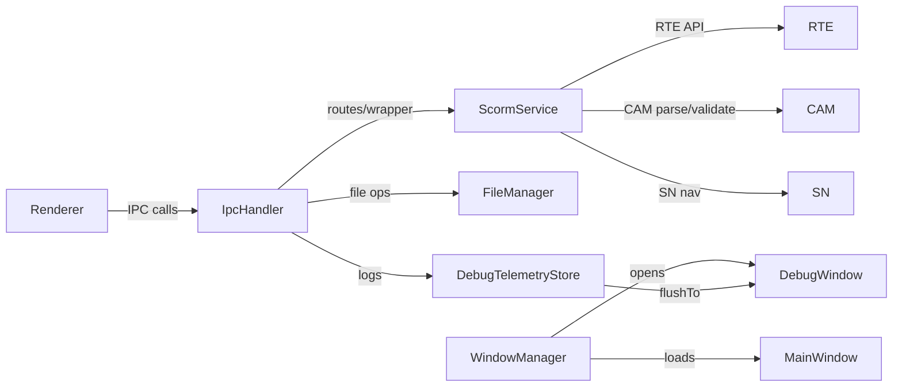
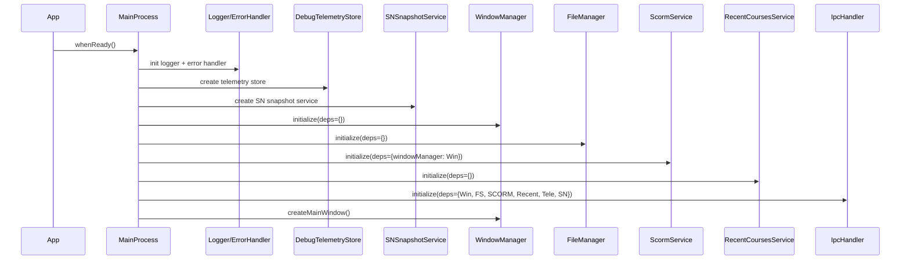

# Main Services Simplification Plan — Preserve SCORM Coverage, Improve Clarity

Purpose
- Keep all existing functionality aligned with SCORM 2004 goals while simplifying the main process services for reliability, easier maintenance, and clearer troubleshooting of real course issues.
- Maintain transparency: never hide course problems; detect, classify, and communicate them clearly to users, with actionable messages and logs.

Scope
- Applies to main process services:
  - [src/main/services/base-service.js](src/main/services/base-service.js:1)
  - [src/main/services/file-manager.js](src/main/services/file-manager.js:1)
  - [src/main/services/ipc-handler.js](src/main/services/ipc-handler.js:1)
  - [src/main/services/menu-builder.js](src/main/services/menu-builder.js:1)
  - [src/main/services/recent-courses-service.js](src/main/services/recent-courses-service.js:1)
  - [src/main/services/scorm-service.js](src/main/services/scorm-service.js:1)
  - [src/main/services/window-manager.js](src/main/services/window-manager.js:1)
- Complements: [dev_docs/ipc-simplification-plan.md](dev_docs/ipc-simplification-plan.md:1)

Why simplify
- Current complexity increases bug likelihood: routing logic mixed with timers, caches, and ad‑hoc policies (notably in [ipc-handler](src/main/services/ipc-handler.js:248) and [scorm-service](src/main/services/scorm-service.js:29)).
- Some operations duplicate concerns across services (debug telemetry buffering appears in multiple places).
- A simplified, declarative, and delegated design improves testability and preserves SCORM compliance goals.

Guiding principles
- Separation of concerns: router routes, services own domain logic, stores persist transient diagnostics.
- Declarative policies: prefer route tables and named profiles to scattered if/else logic.
- Spec-first behavior: map issues to SCORM error semantics and provide human-readable explanations and spec references.
- Observability: structured app log entries; renderer logs travel via dedicated channels; no console in renderer.
- Backward compatible: keep channel names and UI behaviors intact while reducing internal complexity.

Cross-cutting improvements

1) Standard error envelope and SCORM mapping
- Introduce a typed, consistent result envelope for handlers:
  - success: boolean
  - code: string (SCORM error code or internal code)
  - message: string (human-readable)
  - details: object (structured)
  - specRef: string (optional SCORM reference section or clause)
- Map common cases:
  - 0 ok
  - 101 general_exception
  - 103 already_initialized
  - 301 not_initialized
  - 401 invalid_argument_error (or data model specific errors)
- Provide human-readable guidance aligned with the debug window; never swallow or downgrade errors without recording them.

2) Centralize logging policy
- All logs go to the app log via the shared logger. Renderer uses renderer-log-* IPC channels already registered in [ipc-handler](src/main/services/ipc-handler.js:194).
- Each service logs at info for user-impacting events and debug for internal transitions.

3) Minimal validation utilities
- Small helpers for:
  - IPC argument shape validation for critical routes
  - Path string sanity (no traversal, length, existence)
  - Zip entry normalization and traversal protection
- Prefer internal helpers over adding dependencies unless later approved.

4) Telemetry store for debug
- Extract history and replay logic into a DebugTelemetryStore module focused on API call traces and important events.
- IpcHandler, ScormService, and WindowManager delegate publishing to this store; no module keeps its own buffer.

5) Keep explicit user messaging
- For surfaced course problems (missing manifest, invalid manifest, unsafe paths, over‑limit sizes, SN unavailable), return clear message + specRef and log a concise summary to the app log. The UI can render these without guesswork.

Service-by-service simplification

A) BaseService
File: [src/main/services/base-service.js](src/main/services/base-service.js:1)

Keep
- Lifecycle methods and metrics tracking
- Dependency map and event emissions

Simplify
- Optionally reduce verbosity of state change logs (debug-level ok).
- Provide a base helper emitError(code, message, origin) that logs and calls shared errorHandler to standardize error paths across services.

Outcome
- Consistent error/lifecycle scaffolding for all services.

B) FileManager
File: [src/main/services/file-manager.js](src/main/services/file-manager.js:1)

Keep
- Course selection and extraction workflows
- Manifest reading
- Temporary file handling and cleanup

Simplify and harden
- Unify manifest checks to reduce duplication:
  - findScormEntry, getCourseInfo, getCourseManifest share common path validation and manifest existence checks. Implement a shared internal getManifestPath(folderPath) that returns { ok, manifestPath, error }.
- Use OS temp path via app.getPath('temp') or ensure one centralized temp root; avoid repeating ../../../temp construction across methods.
- Harden zip traversal defenses in extractZipWithValidation:
  - Normalize entry paths and verify final resolved path starts with extractPath.
  - Continue to skip suspicious names but add clear counting (skipped vs extracted) to logs for transparency.
- Size and count limits:
  - Make limits configurable via SERVICE_DEFAULTS.FILE_MANAGER and include them in user-facing messages on failure to aid troubleshooting.
- Prefer async fs calls when feasible to avoid blocking the main thread on large packages.
- Add structured return with specRef where applicable (e.g., CAM file structure expectations when manifest is missing).

Outcome
- Fewer repeated checks; explicit error reasons; safer extraction with clear logs.

C) IpcHandler
File: [src/main/services/ipc-handler.js](src/main/services/ipc-handler.js:1)

Keep
- Full channel surface (SCORM RTE, CAM, SN, recent courses, utilities, renderer log channels)

Simplify (per [dev_docs/ipc-simplification-plan.md](dev_docs/ipc-simplification-plan.md:1))
- Declarative routes table and unified wrapper factory.
- Token-bucket limiter with named profiles instead of scattered if/else exemptions.
- Singleflight+debounce utility only for open-debug-window.
- Move SN poller out; serve getStatus from SNSnapshotService.
- Move debug telemetry buffer out to DebugTelemetryStore.
- Convert sync channels to async handle-based registration.
- Shrink wrapHandler to validation, timing, call, envelope, log.

Outcome
- Router is predictable and stateless; services hold state; behavior remains the same for the renderer.

D) ScormService
File: [src/main/services/scorm-service.js](src/main/services/scorm-service.js:1)

Keep
- Role as integration/orchestration layer across RTE, CAM, SN
- Session registry, LMS profile application, scenarios
- Manifest processing and SN initialization path

Simplify and align with SCORM RTE
- Delegate RTE API calls to the RTE module instead of storing values in session.data:
  - getValue, setValue, commit, terminate should call into a dedicated RTE service (existing under [src/main/services/scorm/rte](src/main/services/scorm/rte:1)) if available.
  - ScormService remains session orchestrator and mediator, not a substitute RTE engine.
- Session data:
  - Keep session metadata and traces, but use RTE as system-of-record for the data model and error codes.
- Special elements handling:
  - Keep SN interactions but leverage SN service APIs that interpret RTE changes, rather than duplicating logic. For example, expose explicit methods in SN service to apply progress and exits.
- LMS profiles:
  - Move LMS profiles definition to a separate config module or JSON for clarity and easier maintenance; ScormService loads it on init.
- Debug telemetry:
  - Replace direct notifyDebugWindow calls with publishing to DebugTelemetryStore; Window creation code is decoupled from telemetry capture.

Outcome
- Clear SCORM layering; fewer surprises; error codes and behaviors reflect the RTE engine rather than ad-hoc maps.

E) RecentCoursesService
File: [src/main/services/recent-courses-service.js](src/main/services/recent-courses-service.js:1)

Keep
- MRU management and persistence

Simplify
- Optional: validate existence of course path lazily on retrieval and annotate items with exists flag for UI hints, but do not delete entries automatically (helps user troubleshoot missing paths).
- Ensure JSON write is atomic (write to temp file then rename) to reduce risk of partial writes.

Outcome
- Stays simple; adds user-focused signal (exists true/false) without intrusive behavior.

F) WindowManager
File: [src/main/services/window-manager.js](src/main/services/window-manager.js:1)

Keep
- Main and debug window lifecycle
- Custom protocol registration
- Console-message and error capture to app log

Simplify
- Remove dependency on internal IpcHandler buffers:
  - Replace sendBufferedApiCallsToDebugWindow with a call to DebugTelemetryStore.flushTo(debugWindow.webContents). The previous path checks ipcHandler.handlerMethods (which may no longer exist) are brittle.
- Consolidate webPreferences across windows via a small helper or constants for consistency (avoid accidental drift).
- Guard debug window creation behind a singleflight to avoid duplicates; if open-debug-window logic is simplified in IpcHandler, main still remains safe.

Outcome
- Window management focuses on windows; telemetry is fetched from the telemetry store when needed.

Implementation steps

Phase 1 — Foundations and utilities
- Create DebugTelemetryStore (main) and replace ad-hoc buffers in IpcHandler and ScormService.
- Add minimal ipc-validation and ipc-result helpers.
- Integrate structured logging keys like ipc.success, ipc.error, scorm.session, file.extract.

Phase 2 — IpcHandler consolidation
- Implement routes table, wrapper factory, rate limiter profiles, and singleflight+debounce (see [dev_docs/ipc-simplification-plan.md](dev_docs/ipc-simplification-plan.md:1)).
- Convert sync channels to async without changing channel names.

Phase 3 — ScormService RTE delegation
- Wire getValue, setValue, commit, terminate to the RTE module service.
- Keep session registry and telemetry, but rely on RTE for data model validation and error mapping.

Phase 4 — FileManager hardening and unification
- Introduce getManifestPath(folderPath) and unify manifest-related methods.
- Switch to OS temp path or one canonical temp root; normalize zip extraction checks.

Phase 5 — WindowManager decoupling
- Replace buffered API calls fetch with DebugTelemetryStore.flushTo(webContents).
- Harmonize webPreferences constant across window creations.

Phase 6 — RecentCoursesService refinements
- Add exists flag on retrieval (non-destructive) to aid user awareness.
- Optional: atomic file writes (temp file then rename).

Phase 7 — Validation and envelopes rollout
- Incorporate ipc-validation for critical channels.
- Adopt ipc-result helpers and ensure all handlers return consistent envelopes.

Phase 8 — Tests and docs
- Unit tests:
  - Ipc routes/limiter profiles and singleflight behavior
  - ScormService RTE delegation correctness
  - FileManager zip traversal defense and manifest unification
  - WindowManager telemetry flush path
  - RecentCourses exists-flag
- Documentation:
  - Update [dev_docs/README.md](dev_docs/README.md:1) pointers, note this simplification plan.
  - Ensure module docs reflect the ownership changes (RTE authority, SN integration, telemetry store).

User-facing error transparency

Examples of clear messaging patterns:
- Missing manifest:
  - message: imsmanifest.xml not found in selected folder
  - details: folderPath, attemptedPath
  - specRef: CAM 4th Ed: Content Aggregation Model file structure
- Unsafe path detected in package:
  - message: Unsafe file path in ZIP entry blocked
  - details: entryName
  - specRef: Packaging best practices; security checks
- Oversized package or extracted content:
  - message: Extracted content exceeds configured size limit
  - details: totalBytes, limitBytes
- RTE invalid data model element:
  - message: SetValue failed: invalid data model element
  - details: element, value
  - code: 401
  - specRef: RTE 4th Ed: Data Model

Mermaid overview

Acceptance criteria
- All existing channels remain and function as before; no breaking UI changes.
- Errors are surfaced with clear messages and spec references; no silent soft-ok masking.
- IpcHandler is smaller, deterministic, and policy is declarative.
- ScormService defers RTE logic to the RTE service; sessions remain managed here.
- FileManager provides safer, clearer extraction and manifest handling.
- WindowManager obtains telemetry from a single store.

References
- Architecture rules: [dev_docs/README.md](dev_docs/README.md:1)
- Style and cohesion: [dev_docs/style.md](dev_docs/style.md:1)
- IPC plan: [dev_docs/ipc-simplification-plan.md](dev_docs/ipc-simplification-plan.md:1)
- Current implementations:
  - [src/main/services/ipc-handler.js](src/main/services/ipc-handler.js:1)
  - [src/main/services/scorm-service.js](src/main/services/scorm-service.js:1)
  - [src/main/services/file-manager.js](src/main/services/file-manager.js:1)
  - [src/main/services/window-manager.js](src/main/services/window-manager.js:1)
  - [src/main/services/recent-courses-service.js](src/main/services/recent-courses-service.js:1)
## MainProcess (src/main/main.js) updates required

File: [src/main/main.js](src/main/main.js:1)

Objective
- Align the entrypoint with the simplification plans so services are initialized once, dependencies are injected cleanly, logging is consistent, and new support services (telemetry, SN snapshot) are wired without circular dependencies.

Required updates

1) Remove WindowManager re-initialization and break the implicit IPC dependency
- Current: main re-calls initialize on WindowManager after IpcHandler is ready ([src/main/main.js](src/main/main.js:136)).
- Problem: Services should be initialized exactly once; re-initialization can break state and violates single-responsibility.
- Update:
  - Delete the block that re-initializes WindowManager with IpcHandler:
    - Lines near [src/main/main.js](src/main/main.js:136)–[src/main/main.js](src/main/main.js:141)
  - Ensure [src/main/services/window-manager.js](src/main/services/window-manager.js:450) no longer looks for buffered calls in IpcHandler. It should call a DebugTelemetryStore instead (see below).

2) Introduce and wire DebugTelemetryStore and SNSnapshotService
- Purpose:
  - DebugTelemetryStore centralizes API call/event history; decouples telemetry from IpcHandler/WindowManager/ScormService.
  - SNSnapshotService owns SN status polling/cache and serves sn:getStatus requests, keeping IpcHandler stateless.
- Update:
  - Construct these instances in main and add them to the dependency map before initializing other services.
  - Pass telemetryStore to IpcHandler, ScormService, and WindowManager; pass snSnapshotService to IpcHandler (for sn:getStatus) and ScormService (if needed).
- Example DI snippet:
  - Pseudocode (showing dependency map structure only)
    - const deps = new Map();
    - deps.set('telemetryStore', telemetryStore);
    - deps.set('snSnapshotService', snSnapshotService);
    - Pass deps to services via initialize(deps) or extend with service-specific entries.

3) Eliminate console.* in normal operation; use logger consistently
- Current uses of console.*:
  - [src/main/main.js](src/main/main.js:42), [src/main/main.js](src/main/main.js:53), [src/main/main.js](src/main/main.js:76), [src/main/main.js](src/main/main.js:81), [src/main/main.js](src/main/main.js:269)
- Update:
  - Replace with this.logger?.info/warn/error/debug after the logger is ready.
  - Keep a short-lived console fallback only inside initializeCoreDependencies when logger creation fails.

4) Single pass service initialization with one dependency map
- Current pattern initializes services in order, then re-initializes WindowManager.
- Update:
  - Build a single dependencies map as you construct services; pass only the dependencies each service actually needs (no cycles).
  - Suggested order:
    1. Create logger + errorHandler (core)
    2. Create telemetryStore, snSnapshotService (core services)
    3. Initialize WindowManager (needs nothing but may benefit from telemetryStore)
    4. Initialize FileManager
    5. Initialize ScormService (needs windowManager; optionally telemetryStore)
    6. Initialize RecentCoursesService
    7. Initialize IpcHandler (needs windowManager, fileManager, scormService, recentCoursesService, telemetryStore, snSnapshotService)
  - Do not re-initialize any service.

5) Window open security API modernization
- Current: listens for 'new-window' in app-level hook in [src/main/main.js](src/main/main.js:285).
- Recommended: move to webContents.setWindowOpenHandler inside window creation in [src/main/services/window-manager.js](src/main/services/window-manager.js:170) and [src/main/services/window-manager.js](src/main/services/window-manager.js:80) to apply per-window security policy.
- Keep the app-level guard as a backstop until WindowManager is updated.

6) Certificate error handler scope
- Current: [src/main/main.js](src/main/main.js:275) allows file:// and http://localhost
- Note: scorm-app:// is handled via custom file protocol; certificate-error applies primarily to HTTPS resources. Leave as-is, but document that scorm-app protocol is resolved via [src/main/services/window-manager.js](src/main/services/window-manager.js:251).

7) Feature flag wiring (optional)
- If you enable a feature flag (e.g., process.env.IPC_REFACTOR_ENABLED), pass a boolean to IpcHandler constructor options. This allows gradual rollout of the routes/wrapper/limiter stack without changing main later.

8) Service event listeners remain the same
- Keep the SERVICE_EVENTS listeners for diagnostics ([src/main/main.js](src/main/main.js:171)). They will log structured entries once other services adopt standardized envelopes.

Acceptance criteria
- No service is initialized twice; no circular dependencies.
- IpcHandler does not own SN polling or debug buffers; main created services provide those.
- Logging uses the app logger for all runtime messages; console is only a fallback during logger bootstrap failure.
- WindowManager works without depending on IpcHandler internals.

Mermaid (init sequence)

